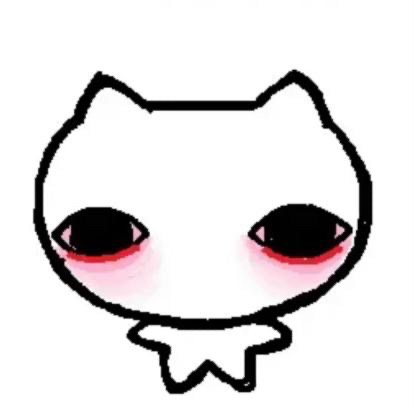

# CSE110 Lab1 Webpage 
## Contents:
1. [Profile](#Profile)
2. [Details](#Details)
3. [Current Work On](#Current)

## Profile:
- **Name:** Angelica C.
- _**Nickname:** Lyka_

- <ins>Slack Profile Picture:</ins>\

>"Comparison is the thief of joy" -Theodore Roosevelt

"My `dearest friend` showed this picture above and has represented us like a mascot for a couple years now ^^"

<ins>Smaller Ver.:</ins>\
 <-- lil guy

## Details
- **Current Favorite Series:** [ENA by Joel Guerra](https://www.youtube.com/@JoelG)
- **Current Favorite Color:** `#95b8b8`
- **Desk Pets:** It all just Kirby figurines

## Currently Working On
Currently in ERSP program associating Prof. Voccaro whose research is focused on social computing.\
**Summary:** My group and I are creating a social media filter that mimics a basic audio-based content moderation with the goal of educating users of the workings and flaws of such systems. ~~(kind of not confident about this one)~~

